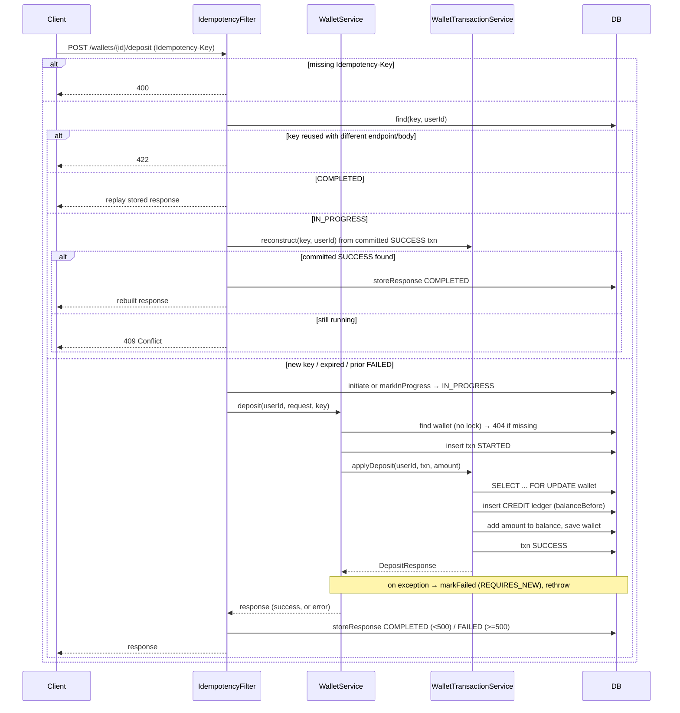
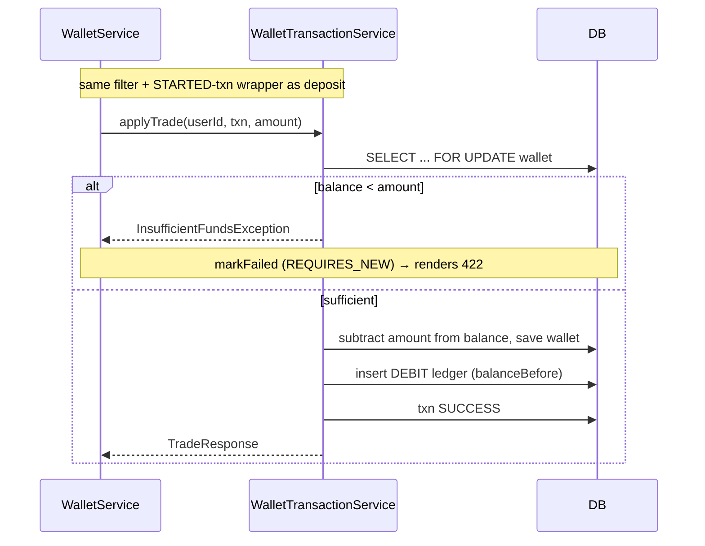

# Wallet Management

A Spring Boot (Kotlin) service for managing user wallets: create a wallet, deposit funds, debit funds via a trade, and read the balance. Money movements are ledger-backed and write APIs are idempotent.

## Major design decisions

- **Layered responsibilities**
  - `WalletController` — HTTP only.
  - `WalletService` — orchestration: validations and business logic for controller.
  - `WalletTransactionService` — the single atomic unit of work: takes the pessimistic row lock, mutates balance + writes the ledger entry + marks the txn `SUCCESS`, all in one `@Transactional` method.
- **Idempotency is a HTTP filter, not service logic.** `IdempotencyFilter` is the one place that sees the final serialized response, so **success and error bodies are captured/replayed uniformly**. This keeps the service layer free of presentation/idempotency concerns and a common place for all endpoints to get idempotency for free. 
- **`balanceAfter` on replay is derived from the immutable ledger entry** (`balanceBefore ± amount`), never the live wallet balance (which has since moved on).
- **Pessimistic locking** (`findByUserIdForUpdate`) happens *inside* the transactional method so the lock is actually held for the read-modify-write; the cheap existence check stays non-locking.
- **Failure handling.** In case of any exceptions in updating the wallet, ledger or transaction entity, the transaction is rolled back and `markFailed` runs in `REQUIRES_NEW` (survives the rolled-back business tx) and updates failure status in transaction entity. 
  - Deterministic failures (`<500`, e.g. `422` insufficient funds, `404` wallet not found) are stored `COMPLETED` and replayed; transient failures (`>=500`) are stored `FAILED` (kept for audit) and **reprocessed** on the next request with the same key.
- **Money** is `BigDecimal`; balances are guarded by DB check constraints (`balance >= 0`, `amount > 0`).

> Trade-off: storing the captured response happens just after the business commit, with `reconstruct` covering the crash window for successes.

Decisions around Idempotency design:
1. We are allowing same idempotency-key across different users. if two users/clients same idempotency-key in the request, their requests will be treated differently. Hence (idempotency_key , user_id) will be unique across transaction history and idempotency table.
2. We are supporting IN_PROGRESS and COMPLETED status to differentiate between a request in flight vs a completed (could be failed or success).

Some common design questions and answers:
Q 1. How are we ensuring duplicate request doesn't go through
Ans : Let's assume a request is already IN_PROGRESS and another request comes in with same idempotency key. We will fetch the existing idempotency record using key and userId. For the IN_PROGRESS already request present in the table , system will check if there is associated entry present in transaction history table with status as success. If the txn is already successful we will just reconstruct the response using ledger and wallet tables to populate the required fields in the response body to return to client and update in idempotency table. 
If there is no successful transaction present in the system, error response with conflicting response is sent back to client because the original request is still in progress executing the business logic.
Above flow ensures that:    
    - Only one transaction is on going at a time 
    - If for some reason transaction was successful in first attempt but process failed before updating the status in idempotency table, then the next attempt acts as reconciliation process updating both client and system with correct data.

Q 2.  How 5xx and 4xx errors are handled in terms of idempotency?
Ans: Request with 5xx errors are marked as FAILED in idempotency table for client to reprocess the request on the next attempt. Old transactions and ledger entries would have been rolled back during atomic update.
Requests with 4xx errors are stored as COMPLETE and 4xx status and response body with failed message in idempotency table and the response is returned back to client from this table itself upon receiving duplicate request.

Q 3. Let's say there are two concurrent request for deposit and trade for a single user. How is lost update prevented in this case?
Ans. In both depist and trade the flows we are using pessismistic locking on wallet as the first instruction which ensures only one thread gets the row level block on wallet. Only once first process either succeeds or fails, the other thread will get to process the request.

Q 4. How are we ensuring that getBalance for a wallet doesn't see partially updated response.
Ans. While a write flow is updating the wallet balance, getBalance read only flow gets access to only last committed version of wallet balance. It doesn't ever see partially updated values due to use of @transactional.


## API

| Method | Path | Notes |
|---|---|---|
| `POST` | `/wallets/{userId}` | Create wallet (`409` if exists) |
| `GET` | `/wallets/{userId}` | Get balance (`404` if missing) |
| `POST` | `/wallets/{userId}/deposit` | Credit; requires `Idempotency-Key` header |
| `POST` | `/wallets/{userId}/trade` | Debit; requires `Idempotency-Key` header (`422` on insufficient funds) |

## Deposit flow



## Trade flow

Identical to deposit except `WalletTransactionService.applyTrade` first checks funds and **debits**:



## Database schema

DDL is generated by Hibernate (`ddl-auto: create-drop`, in-memory H2).

### `wallets`
The wallet table is the row that represents "this user has an account here" — a single, lockable, state of user's funds. Every user can have at most one wallet.
It has a balance column for efficiently accessing balance in hot path before every write operation and lock on this keeps the concurrent writes sequential. 
It eliminates the need of recalculating ledger entry sums repeatedly. It guards against negative balances with a check constraint, but the service layer is still responsible for enforcing business rules around sufficient funds for trades.

| Column | Type | Constraints |
|---|---|---|
| `id` | UUID | **PK** |
| `user_id` | UUID | NOT NULL, **UNIQUE** (`uq_wallets_user_id`) |
| `balance` | DECIMAL(10,2) | NOT NULL, CHECK `balance >= 0` |
| `created_at` | timestamp | NOT NULL |
| `updated_at` | timestamp | NOT NULL |

Future scope:
It can have columns like Currency, State (like ACTIVE, SUSPENDED).

### `transaction_history`
Keeps record of every user-facing operation - deposit or trade requests. Decouples the request lifecycle from the ledger. Failure state and related reason live here without polluting the book of record. 
It also serves as the basis for reconstructing responses for idempotent replays, ensuring that we can accurately reflect the outcome of the original transaction even if the wallet state has changed since then.

| Column | Type | Constraints |
|---|---|---|
| `id` | UUID | **PK** |
| `wallet_id` | UUID | NOT NULL, FK → `wallets.id` |
| `user_id` | UUID | NOT NULL |
| `idempotency_key` | varchar | nullable |
| `operation` | varchar(10) | NOT NULL (`DEPOSIT`/`TRADE`) |
| `status` | varchar(10) | NOT NULL (`STARTED`/`SUCCESS`/`FAILED`) |
| `amount` | DECIMAL(10,2) | NOT NULL, CHECK `amount > 0` |
| `failure_reason` | TEXT | nullable |
| `created_at` | timestamp | NOT NULL |
| | | **UNIQUE** (`idempotency_key`, `user_id`) — `uq_txn_key_user` |

Future Scope:
Other columns that this table can have: asset_symbol, asset_quantity, price_at_execution, parent_txn_id for refunds etc. We may want to split deposit and trade into separate tables if their data diverges significantly, but for this simple model they can share a table with nullable columns.

### `ledger_logs`
Immutable, append-only record of every actual money movement. The book of record. It records successful operations only - failed trades/deposits never make it to ledger. 
No UPDATE and DELETE supported on the table. One business transaction can lead to more than 1 ledger entries. It is the source of truth from accounting and auditing point of view.

| Column | Type          | Constraints |
|---|---------------|---|
| `id` | UUID          | **PK** |
| `wallet_id` | UUID          | NOT NULL, FK → `wallets.id` |
| `txn_id` | UUID          | NOT NULL, FK → `transaction_history.id` |
| `type` | varchar(10)   | NOT NULL (`CREDIT`/`DEBIT`) |
| `amount` | DECIMAL(10,2) | NOT NULL, CHECK `amount > 0` |
| `balance_before` | DECIMAL(10,2) | NOT NULL |
| `created_at` | timestamp     | NOT NULL |
| |               | Index `idx_ledger_wallet_created` (`wallet_id`, `created_at`) |


### `idempotency`
It captures the intent to perform an operation. Its written first, before any business work, so that retries can be detected even if the business work is still in progress.  
It is essentially a request de duplication gate.

| Column | Type | Constraints |
|---|---|---|
| `id` | UUID | **PK** |
| `idempotency_key` | varchar | NOT NULL |
| `user_id` | UUID | NOT NULL |
| `endpoint` | varchar | NOT NULL |
| `request_hash` | varchar(64) | NOT NULL |
| `status` | varchar(15) | NOT NULL (`IN_PROGRESS`/`COMPLETED`/`FAILED`) |
| `response_body` | TEXT | nullable |
| `response_status` | int | nullable |
| `response_content_type` | varchar | nullable |
| `created_at` | timestamp | NOT NULL |
| `expires_at` | timestamp | NOT NULL (24h TTL) |
| | | **UNIQUE** (`idempotency_key`, `user_id`) — `uq_idem_key_user` |
| | | Index `idx_idempotency_user_id` (`user_id`, `idempotency_key`) |

> Idempotency keys are scoped **per user**: the same key may be reused by different users. Both `idempotency` and `transaction_history` enforce this with a composite unique on (`idempotency_key`, `user_id`).

## Running the application

Requires JDK 21 (the Gradle toolchain will provision it).

```bash
./gradlew bootRun
```

The app starts on `http://localhost:8080`. H2 console: `http://localhost:8080/h2-console` (JDBC URL `jdbc:h2:mem:walletdb`, user `sa`, no password).

Example:

```bash
USER=$(uuidgen)
curl -X POST localhost:8080/wallets/$USER
curl -X POST localhost:8080/wallets/$USER/deposit \
  -H 'Content-Type: application/json' -H "Idempotency-Key: $(uuidgen)" \
  -d '{"amount":"100.00"}'
curl localhost:8080/wallets/$USER
```

## Running tests

```bash
# Everything
./gradlew test

# Unit tests only (service layer, mocked collaborators)
./gradlew test --tests "org.example.walletmanagement.service.*"

# Integration test only (full Spring context + filter + in-memory DB via MockMvc)
./gradlew test --tests "org.example.walletmanagement.controller.WalletControllerIntegrationTest"
```

- **Unit:** `WalletServiceTest`, `WalletTransactionServiceTest`, `IdempotencyReplayServiceTest` — Mockito mocks, no Spring/DB.
- **Integration:** `WalletControllerIntegrationTest`, `WalletIdempotencyIntegrationTest`, `WalletConcurrencyIntegrationTest.kt` ,`WalletIdempotencyServerErrorIntegrationTest` — `@SpringBootTest` + `MockMvc`, real beans and H2.

Test result report: `build/reports/tests/test/index.html`.

### Coverage report

Coverage is generated by JaCoCo and runs automatically after `./gradlew test` (no minimum-coverage gate is enforced). To (re)generate it explicitly:

```bash
./gradlew jacocoTestReport
```

Reports:
- HTML: `build/reports/jacoco/test/html/index.html`
- XML: `build/reports/jacoco/test/jacocoTestReport.xml`

## Future Scope:
1. Support for currency with proper handling of exchange rates and precision.
2. Handle multiple wallets per user, e.g. for different asset types or purposes (savings vs spending).
3. Support for multiple ledger entries per transaction, e.g. for recording fees.
4. Caching idempotency results for faster replays of duplicate requests.